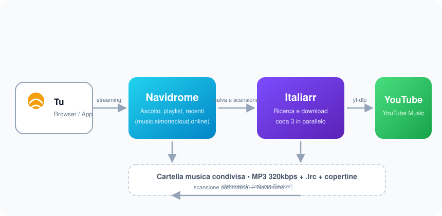
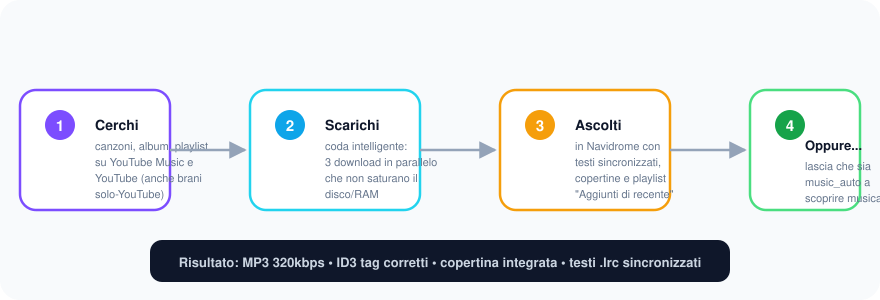

<div align="center">

# 🎵 Italiarr

### Scarica e ascolta la tua musica — semplicemente

Italiarr è un **server di download musicale** self-hosted: cerchi una canzone o un album, lo scarichi da
YouTube/YouTube Music come **MP3 320kbps con testi sincronizzati (`.lrc`) e copertina**, e lo ritrovi
subito nella tua libreria musicale (Navidrome) pronta per l'ascolto.

</div>

---

## ✨ Perché Italiarr?

| | |
|---|---|
| 🔍 **Cerca ovunque** | Trova canzoni e album su YouTube Music **e** su YouTube (anche i brani che esistono solo su YouTube, come certe uscite speciali) |
| ⏱ **Coda intelligente** | I download partono in **parallelo (3)** ma senza saturare disco e RAM |
| 🎼 **Qualità** | MP3 a **320kbps** con ID3 tag corretti, **copertina integrata** e **testi sincronizzati** |
| 📚 **Album completi** | Scarica un intero album con un click — funziona anche con le playlist/serie solo-YouTube (trailer esclusi) |
| 🧠 **Niente doppioni** | I brani già in libreria vengono riconosciuti e saltati |
| 📊 **Storico** | Ogni download resta registrato con data, stato e origine (manuale o automatico) |
| 🎁 **Automazione** | Con `music_auto.py` trova da sola nuova musica ogni 10 minuti, la scarica e aggiorna le playlist |
| 🔒 **Sicuro** | Password di accesso salvate solo come hash SHA-256 |

---

## 🏗 Come funziona



1. **Tu** apri la web app di Italiarr (o l'automazione `music_auto`)
2. **Italiarr** cerca e scarica da **YouTube / YouTube Music** usando `yt-dlp`
3. I file (**MP3 + .lrc + copertine**) finiscono nella cartella musica condivisa
4. **Navidrome** la scansiona automaticamente e la musica è subito ascoltabile

---

## 🚀 Installazione

### Opzione A — Docker (consigliata)

```bash
git clone https://github.com/<TUO-UTENTE>/italiarr.git
cd italiarr

# imposta la tua password
export ITALIARR_PASSWORDS="scegli-una-password-forte"

docker build -t italiarr .
docker run -d \
  -p 8686:8686 \
  -e ITALIARR_PASSWORDS="$ITALIARR_PASSWORDS" \
  -v /percorso/della/mia/musica:/data/music \
  --name italiarr \
  --restart unless-stopped \
  italiarr
```

Oppure con **docker compose** (vedi [`docker-compose.example.yml`](docker-compose.example.yml)):

```bash
cp docker-compose.example.yml docker-compose.yml
# modifica ITALIARR_PASSWORDS nel file
docker compose up -d
```

### Opzione B — Python diretto

```bash
pip install -r requirements.txt
ITALIARR_PASSWORDS="la-tua-password" uvicorn main:app --host 0.0.0.0 --port 8686
```

Apri poi il browser su **http://localhost:8686** e accedi con la password scelta.

> 💡 **Prima di tutto**: nella cartella musica che monti in `/data/music`, crea una sottocartella
> `Playlists/` (ci finiscono le playlist generate, vedi sotto).

---

## ⚙️ Configurazione

| Variabile | Default | Descrizione |
|---|---|---|
| `ITALIARR_PASSWORDS` | `italiarr` | Password di accesso, separate da virgola se ne vuoi più di una. **Cambiala!** |
| `ITALIARR_MUSIC_DIR` | `/data/music` | Cartella dove vengono salvati i brani |

---

## 🎮 Come si usa



### 1️⃣ Cerchi
Nella barra di ricerca scrivi un artista, una canzone o un album, poi scegli la scheda **Singoli Brani**
o **Interi Album**. I risultati della tua libreria compaiono per primi.

### 2️⃣ Scarichi
- **Singolo brano** → click su *Scarica MP3*
- **Intero album** → click su *Scarica Album Intero*

I download vanno in coda (3 alla volta) e in fondo vedi lo stato: *in coda → scaricando → completato*.
Se un brano è già in libreria viene marcato come *già presente* senza riscaricarlo.

### 3️⃣ Ascolti
Apri Navidrome (o la tua app musicale preferita che parla Subsonic/Jellyfin):
- la nuova musica è in **Recenti / Aggiunti di recente**
- i **testi sincronizzati** (.lrc) compaiono nella schermata del player
- le copertine sono già integrate nei file

### 📊 Storico
Il tab **Storico** mostra tutti i download: data, stato e origine — **Auto added** (dall'automazione)
o **Downloaded** (fatto a mano). Lo storico è persistente (sopravvive ai riavvii).

---

## 🤖 Automazione (`music_auto.py`)

Vuoi che la libreria si riempia **da sola**? `music_auto.py` ogni 10 minuti:

1. raccoglie i tuoi **preferiti** (Navidrome + Last.fm: loved, top, artisti simili)
2. controlla cosa **manca** in libreria (niente doppioni)
3. cerca su YouTube Music e accoda i brani mancanti (max 5 per run)
4. aggiorna la playlist **`Discover Weekly Auto`** e **`Aggiunti di recente`** in Navidrome

```bash
# configuralo con le tue chiavi (vedi music_auto.py in testa al file)
export ITALIARR_URL="http://localhost:8686"
export ITALIARR_PASSWORD="la-tua-password"
export LASTFM_API_KEY="..."
export LASTFM_SECRET="..."

# nel crontab:
*/10 * * * * python3 /percorso/italiarr/music_auto.py >> /var/log/music_auto.log 2>&1
```

---

## 🗂 Struttura del progetto

```
italiarr/
├── main.py                  # l'app (FastAPI): ricerca, download, coda, storico
├── static/                  # interfaccia web (HTML/CSS/JS)
├── music_auto.py            # automazione opzionale (scoperta musica)
├── Dockerfile               # build Docker
├── requirements.txt         # dipendenze Python
└── docker-compose.example.yml
```

---

## ❓ Domande frequenti

- **Perché la password va in `ITALIARR_PASSWORDS`?** Nel codice sono salvati solo gli hash SHA-256,
  mai la password in chiaro; configurandola via variabile d'ambiente nessun segreto finisce nel repo.
- **Si possono scaricare canzoni che non sono su YouTube Music?** Sì: la ricerca ha un fallback su
  YouTube vero e proprio, quindi trovi anche uscite esclusive.
- **Posso usare un altro server musicale al posto di Navidrome?** Italiarr salva semplicemente i file:
  qualsiasi server che scansiona una cartella (Jellyfin, Plex...) va bene.

---

## 📄 Licenza

[MIT](LICENSE)
